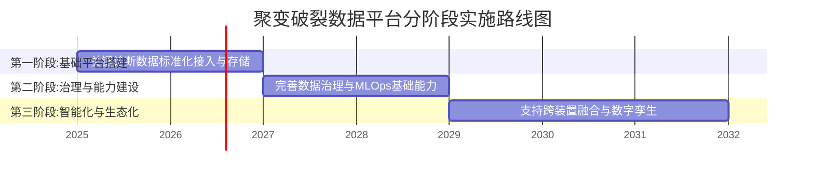

聚变等离子体破裂数据平台技术综述：现状、架构与研发落地路径# 1 聚变破裂数据生态：类型、来源与标准化挑战

聚变等离子体破裂研究正日益依赖于对海量、多维度实验数据的深度挖掘。本章节旨在系统梳理支撑该研究的核心数据类型、来源及其技术特征，构建一个全面的数据生态视图。分析范围覆盖了EAST、HL-2A/HL-3、J-TEXT等主要托卡马克装置产生的时序诊断信号、破裂事件标签、装置运行元数据以及物理模拟数据。研究发现，尽管数据来源丰富且物理价值巨大，但当前生态呈现出显著的碎片化特征，在数据质量、标准化程度以及FAIR（可查找、可访问、可互操作、可重用）原则的落实方面面临严峻挑战，这些挑战直接制约了高质量破裂预测模型的开发与跨装置泛化能力。

## 1.1 核心数据类型与物理内涵

聚变破裂研究依赖于多维度、多尺度的数据，这些数据按其物理内涵和作用可分为四大类：时序诊断信号、破裂事件标签、装置运行元数据以及物理模拟数据。它们共同构成了理解、预测和缓解破裂现象的数据基础。

**时序诊断信号**是数据驱动模型最直接的输入，直接反映了等离子体状态的时空演化。这些信号种类繁多，物理内涵各异：
*   **磁学信号**：如磁通、等离子体电流、环向磁场等，是监测等离子体宏观平衡和磁流体不稳定性的基础。
*   **热学与辐射信号**：电子温度、离子温度、辐射功率等。其中，**电子回旋辐射成像诊断（ECEI）** 作为一种先进诊断，能够捕捉电子绕磁力线做拉莫回旋运动产生的辐射，从而**提供托卡马克中电子温度及其涨落的二维时空演化数据，具备高时空分辨率（时间分辨率可达1 µs，空间分辨率约1-2.5 cm）**^[1]^。这类数据对于观测破裂前兆中的微观不稳定性（如撕裂模、边界局域模）至关重要。
*   **密度与杂质信号**：电子密度、杂质辐射（如软X射线）等。杂质积累是引发破裂，特别是杂质破裂和密度极限破裂的关键因素之一^[2][3]^。

**破裂事件标签**是监督学习模型的“正确答案”，其定义的准确性和一致性至关重要。根据物理影响和特征，破裂主要分为：
*   **大破裂**：指等离子体能量和电流在极短时间内完全损失，会对装置第一壁产生巨大的热应力和电磁应力，是ITER亟需解决的关键问题^[4]^。
*   **小破裂与部分破裂**：等离子体温度和储能有所下降，但放电不会终止，其物理机制研究与理解大破裂密切相关^[4]^。
*   **特定类型的破裂**：如**密度极限破裂**（超过经验密度极限引发）^[5][3]^和**杂质破裂**（由杂质积累触发）^[2]^。研究需根据这些物理特性从历史放电数据中筛选和标注相应的炮数据以构建训练集^[2][5]^。

**装置运行元数据**提供了数据产生的物理背景和上下文，是实现模型跨参数泛化的关键。这类数据通常是标量或低频演化参数，包括：
*   **全局运行参数**：等离子体电流（Ip）、环向磁场（Bt）、安全因子（q95）、储能（W）、比压（β）等。研究团队常依据这些参数将数据划分为不同的参数区间，以测试模型的跨区间泛化能力^[6]^。
*   **实验设置与控制参数**：如加热功率、加料策略、壁条件等。

**物理模拟数据**作为实验数据的补充，用于机理研究、场景预演和数据增强。集成建模与分析套件（IMAS）提供了一系列用于托卡马克等离子体场景的物理建模代码（如SOLPS-ITER用于边缘等离子体建模，DINA用于等离子体模拟），其产生的标准化数据有助于深化对破裂物理过程的理解^[7][8]^。

## 1.2 数据来源、采集与同步性分析

聚变破裂数据产生于全球多个托卡马克装置，并通过日益复杂的诊断系统采集，其技术特征对数据平台提出了高要求。

**数据来源装置与诊断系统**呈现多元化。国内主要装置如EAST（全超导托卡马克）、HL-2A/HL-3（中国环流系列）、J-TEXT等，以及国际装置如Alcator C-Mod、DIII-D等，均产生了大量用于破裂研究的数据^[6][9]^。各装置配备了特色诊断，例如，J-TEXT建立了频率高达10kHz的动态扰动场系统（为国际上现有在运行扰动场系统中最高），并配备了具备远程数字控制功能的256通道ECEI诊断^[10][1]^。EAST则集成了包括汤姆逊散射、电荷交换复合光谱在内的多种先进诊断用于破裂预警研究^[11]^。

**数据采集特性**面临“三高”挑战——高采样、高维度、高增长。现代诊断如ECEI的时间分辨率可达微秒级，产生海量的二维时空数据^[1]^。随着实验复杂度的提升，单次实验产生的数据量已从早期的数GB增长至数十甚至上百GB^[12]^。**多源诊断数据之间的时间同步是构建可靠训练样本的关键技术瓶颈**，不同诊断设备时钟的精确对齐直接影响到特征提取和物理关联分析的准确性。

**现有数据采集与传输架构**旨在应对这些挑战。EAST等装置建立了集成化的数据与信息系统，提供高速网络通信、海量数据存储和服务功能，通过控制网络、采集网络等VLAN的划分保障数据安全与有效隔离^[13]^。为满足实验人员实时获取数据的需求，EAST还开发了基于即时通信框架的系统，实现实验数据的订阅与推送^[14]^。J-TEXT则建立了其CODAC系统，并率先将ITER CODAC中的部分技术运用于装置^[10]^。然而，面对数据量的指数级增长，传统的数据管理方式在存储、处理和分析方面仍显得力不从心^[12]^。

## 1.3 数据标注、元数据与质量现状

在数据采集之后，标注、描述和质量控制环节的现状直接决定了数据的可用性与价值，当前这些环节存在显著挑战。

**数据标注的一致性与标准化问题突出**。破裂事件的标注高度依赖于物理判断，但目前缺乏全球统一的标注标准。这导致：
*   **定义不一致**：对于“破裂起始时刻”、“预警时间窗口”的判定，不同研究团队可能采用不同的物理阈值或算法，使得不同数据集难以直接比较或合并^[15]^。
*   **筛选标准差异**：例如，构建杂质破裂训练数据库时，需要根据杂质破裂的物理特性从海量炮数据中筛选正负样本，这一过程的主观差异会影响数据集的质量^[2]^。这种“调查方法与数据标准一致性不足”的状况，使得不同部门的数据难以“互通互认”^[15]^。

**元数据描述普遍不完备**。元数据是描述数据背景信息（如实验条件、诊断校准参数、数据处理历史）的数据，对于数据的可理解性和可重用性至关重要。然而，当前许多数据缺乏足够丰富和结构化的元数据。部分在线平台存在“更新滞后、标准模糊等不足”，进一步加剧了“信息孤岛”效应^[15]^。没有完备的元数据，数据的物理含义和产生背景将随时间流逝而变得模糊，严重损害其长期价值。

**数据质量问题直接影响模型性能**。主要问题包括：
1.  **信号噪声与缺失**：诊断信号难免受到各种噪声干扰，且设备故障可能导致数据片段缺失。为应对噪声，一些研究采用物理定标率中的标量参数作为模型输入特征^[16]^。
2.  **样本不平衡与稀缺**：破裂事件，尤其是大破裂，在实验中是相对稀少的事件，导致正样本数量远少于负样本。更严峻的是，**代表未来聚变堆运行条件的高参数区间（高电流、高磁场、高比压）的破裂数据极度缺乏**^[6]^。
3.  **标注错误与偏差**：过度商业化的压力可能侵蚀研究者的职业道德，冲击数据的可靠性^[15]^。标注过程中的人为错误或物理理解偏差也会引入标签噪声。

这些问题共同导致了一个核心困境：**在破裂预测算法未得到充分验证前，装置不能冒险在高参数区间运行；而没有高参数区间的数据，又无法构建可靠的预测算法**^[6]^。打破这一“先有鸡还是先有蛋”的循环，需要创新的方法和对数据质量的系统性提升。

## 1.4 标准化缺失与FAIR原则落地挑战

当前聚变破裂数据生态的深层瓶颈在于标准化体系的缺失与FAIR原则落实的不足，这从根本上限制了数据的集成、共享与高效利用。

**标准化缺失是“信息孤岛”的根源**。尽管ITER组织主导的**IMAS数据字典**作为一项独立于具体装置的聚变数据通用标准，能够统一描述实验和模拟数据，并已开源其基础设施软件^[8]^，但其在领域内的全面采纳和落地仍需时间。大量历史数据及部分现有装置级数据系统（如基于MDSplus的系统）并未完全兼容此标准，导致数据格式、接口和语义层面的不统一^[12]^。这种标准化缺失使得跨装置、跨团队的数据整合与分析变得异常困难。

**以FAIR原则为框架评估，现状挑战严峻**：
*   **可查找性**：数据分散在各个装置或团队内部，缺乏全局统一的元数据目录和注册服务。FAIR原则要求数据被分配全球唯一且恒久的标识符，以消除歧义并便于引用，但当前实践与此相去甚远^[17]^。
*   **可访问性**：数据访问存在多重壁垒。一方面，由于安全、知识产权或政策限制，许多高价值数据仅限于内部访问；另一方面，即使愿意共享，也因缺乏透明的访问协议和权限管理机制而流程复杂。“数据管理与应用机制不健全，跨部门、跨机构数据共享壁垒难破”是普遍现象^[15]^。
*   **可互操作性**：核心在于数据能否被不同的软件工具无障碍使用。由于数据格式、模式不统一，且缺乏机器可读的元数据，数据互操作性差。科学家常常需要花费大量时间手动处理数据格式问题，而非专注于科学分析本身^[18]^。
*   **可重用性**：这是FAIR原则的最终目标。可重用性要求数据附带有丰富的元数据和上下文信息，详细说明数据的来源、产生条件和处理过程^[19]^。当前，由于标注不一致、元数据缺失和背景信息不完整，数据的可信度和有效复用价值大打折扣，其他研究者难以在完全理解其背景的情况下重复使用这些数据。

**推进数据标准化和全面落实FAIR原则已不仅是技术优化，而是释放聚变破裂数据全部潜力、加速人工智能模型研发、最终实现聚变能源应用的战略必需**。这需要装置单位、研究团队、数据平台开发者以及国际组织（如ITER、IAEA）的协同努力，共同构建一个开放、协作、高效的数据生态。

# 2 平台技术架构演进：从数据采集到智能治理的全链路设计

构建一个能够有效支撑聚变等离子体破裂研究的数据平台，需要一套覆盖数据全生命周期的、系统性的技术架构。本章旨在为研发团队提供从高速数据采集到智能治理的全链路设计指南。我们将深入分析应对高维高频数据流的技术方案，对比核心存储与计算架构的选型，设计实现FAIR原则与安全管控的治理体系，并探讨如何集成MLOps理念以实现数据与模型资产的协同治理。最终，通过综合对比不同架构模式，为研发团队提供清晰的落地建议与分阶段实施路径。

## 2.1 数据采集与传输：应对高维高频的实时数据流

聚变装置实验产生的数据具有高采样频率、多源异构和强实时性要求等特征。例如，电子回旋辐射成像（ECEI）等先进诊断可提供微秒级时间分辨率的二维时空数据^[20]^。为有效捕获和处理这类数据流，需要设计一套从边缘到中心的高性能采集与传输架构。

**核心挑战与设计原则**：传统单机脚本模式在数据规模超过100TB后很快会失效^[21]^。因此，现代架构需遵循“数据不动，算力移动；逻辑集中，物理分布”的核心原则^[21]^。计算节点应能像访问本地存储一样，无缝访问分布在数据湖中的PB级数据，从而避免不必要的数据搬迁，提升处理效率。

**高速数据采集与前端处理**：在装置侧，数据采集系统（CODAC）需要集成多种诊断设备，如用于测量磁场的磁学设备、测量密度和温度分布的汤姆逊散射（TS）、以及测量离子温度和流速的电荷交换复合（CER）光谱学等^[11]^。这些设备产生的原始信号，首先需要通过**轮廓重建和平衡拟合**等预处理步骤，被处理成具有相同维度和空间分辨率的结构化数据，以便后续输入到AI模型中^[11]^。为降低信号噪声对模型的干扰，一种有效策略是**以物理定标率中的标量参数作为模型的输入特征**^[16][20]^。此外，在数据源头进行初步的滤波、降维或特征提取等边缘计算，可以有效减轻中心存储和网络传输的压力，为后续章节讨论的“边-云协同”架构奠定基础。

**实时数据传输与同步机制**：为实现实验数据的实时监控与在线分析，需要构建低延迟、高吞吐的数据传输通道。EAST装置开发了基于即时通信框架的系统，实现了实验数据的订阅与推送功能。在架构上，可采用**发布/订阅模式的消息队列**（如Apache Kafka）作为数据总线，将不同诊断系统产生的数据流统一接入。关键在于保障**多源诊断数据的时间同步精度**，这通常需要通过硬件时钟同步协议（如PTP）结合软件时间戳校正来实现，确保不同数据流在时间轴上的严格对齐，为后续的融合分析提供可靠基础。

## 2.2 存储与计算架构：时序数据库、数据湖仓与混合模式选型

面对每秒可达千万点的高频传感器数据洪流，传统以Flink、Spark、Hadoop为核心的多技术栈方案因架构复杂、数据流转延迟高、存储与运维成本激增而面临严峻挑战^[22]^。专为时间序列数据设计的时序数据库（TSDB）已成为工业物联网（IIoT）数据基座的首选，这一结论同样适用于聚变数据场景^[22]^。本节将系统分析核心存储与计算架构的技术选型。

**时序数据库（TSDB）核心选型对比**：聚变诊断数据本质上是带时间戳的指标序列，对时序数据库的写入吞吐、查询延迟和压缩比有极高要求。市场上主流TSDB在技术路线上具有显著差异性^[22]^。
*   **InfluxDB**：作为专注指标与监控场景的开源先驱，它采用专为时序设计的Tagset数据模型（Measurement, Tags, Fields），写入查询性能优异，但处理复杂关系型查询或需要水平扩展集群时，需商业版支持，运维复杂度较高^[23][24][25]^。
*   **TimescaleDB**：作为PostgreSQL的扩展，它完全拥抱SQL与关系型生态，支持复杂的窗口函数和事务，对已有PostgreSQL技能的DBA学习成本极低^[23][24]^。但其开源版本在报告撰写时仍不支持真正的多节点写入水平扩展^[26]^。
*   **DolphinDB**：这是一款以C++编写的高性能分布式时序数据库，采用列式内存引擎，支持在高吞吐低延迟的数据流中进行复杂编程和运算，提供了“存算一体融合引擎”的技术思路^[22][26]^。它在特定领域（如量化金融）展现出卓越性能，测试中其数据导入性能可达TimescaleDB的十倍甚至百倍以上^[26]^。
*   **金仓时序数据库**：作为信创场景下的国产化解决方案，它针对时序数据读写特征重构了存储引擎（K-TimeEngine），支持毫秒至微秒级时间精度自动分区，单表可承载百亿级时间点，实测平均压缩比达1:8.3，单节点写入吞吐达128万点/秒^[27]^。其全栈安全能力强化，支持国密算法和等保2.0三级审计规范，并提供了从InfluxDB/TimeScaleDB平滑升级的零代码迁移能力^[27][28]^。

为了更清晰地对比这四类时序数据库在聚变数据场景下的关键特性，我们梳理如下：

| 特性维度 | InfluxDB | TimescaleDB | DolphinDB | 金仓时序数据库 |
| :--- | :--- | :--- | :--- | :--- |
| **数据模型** | 专有时序模型 (Measurement/Tag/Field) | 关系模型 (PostgreSQL扩展) | 融合时序与关系模型 | 时序优化关系模型 |
| **查询语言** | InfluxQL, Flux | 标准SQL | 类SQL + 脚本语言 | 兼容InfluxQL/标准SQL |
| **写入性能** | 优异 | 良好 | **极高性能** (测试领先) | **高性能** (128万点/秒/节点)^[27]^ |
| **复杂分析** | 较弱 (Flux学习曲线陡) | **强大** (完整SQL支持) | **强大** (内置计算引擎) | 强大 (SQL支持) |
| **集群扩展** | 商业版支持 | 开源版限制多 | 支持 | 支持 |
| **运维复杂度** | 集群运维复杂 | **极低** (同PostgreSQL) | 中等 | 相对简单 |
| **特殊优势** | 监控生态成熟 | 关系型生态无缝集成 | 存算一体，流批融合 | **国产化、全栈安全、平滑迁移**^[27][28]^ |

**数据湖仓一体架构的必然性**：单纯使用时序数据库难以满足聚变研究对多模态数据（如二维ECEI图像、模拟数据、文档）统一管理、探索性分析和长期数据治理的需求。数据仓库强调规范与性能，但建设成本高、灵活性不足；数据湖支持任意数据类型的原始存储（保真性），具备“读取型schema”的灵活性，但缺乏治理易退化为“数据沼泽”^[29][30]^。**湖仓一体架构融合二者优势，在低成本存储原始数据的同时，提供数据仓库级的管理、优化与治理能力**，已成为大数据平台演进的主流趋势^[31][29]^。例如，Apache Hive通过支持Iceberg等表格式，已演进为湖仓一体的核心组件，在TPC-DS测试中性能显著提升^[32]^。

**混合存储与计算架构实践**：一个理想的聚变数据平台应采用分层、混合的架构。底层是**分布式对象存储**（如SeaweedFS Cluster）构成的**数据湖**，用于持久化保存所有原始数据、处理中间结果及归档数据，提供高带宽读取和线性扩展能力^[21]^。在其之上，针对热数据或需要极速查询的数据，可以构建**时序数据库集群**作为**性能加速层**。计算层面，采用**分布式计算框架**（如Ray Cluster）实现“算力移动”，Ray可以将Python任务从单机扩展到多节点GPU/CPU混合集群，负责感知模型推理、特征提取、数据清洗等任务^[21]^。这种“存算分离”的架构，实现了存储资源的独立扩展与计算资源的弹性调度，达成了成本、性能与灵活性的最佳平衡。

## 2.3 数据治理与安全：实现FAIR原则与细粒度管控

高质量的数据是AI模型的基石，而数据治理是确保数据质量、安全性与可用性的系统工程。对于聚变研究，必须以FAIR原则（可查找、可访问、可互操作、可重用）为纲领，构建覆盖数据全生命周期的治理体系^[33][34]^。

**以FAIR原则为核心的数据治理框架**：
*   **可查找**：为所有数据资产分配**唯一且持久的标识符**，如数字对象标识符（DOI）或中国科学院科技资源标识符（CSTR），并通过统一的元数据目录进行注册^[35]^。科学数据中心软件栈FairStack中的机构数据存储库工具InstDB即提供此类功能^[35]^。
*   **可访问**：设计清晰、标准化的数据访问协议和接口。通过**基于角色的访问控制**和**细粒度权限管理**，在保障数据安全的前提下，促进数据在可控范围内的共享，打破“数据共享壁垒”。
*   **可互操作**：采用领域通用的数据标准是核心。**ITER的IMAS数据字典**是聚变领域实现数据互操作的关键，平台应支持IMAS数据模型，或提供与IMAS格式的无损转换工具^[36]^。元数据应使用机器可读的语言（如JSON-LD, XML Schema）描述。
*   **可重用**：为数据附加以丰富、结构化的**元数据**，详细描述数据的来源、实验条件、校准信息、处理历史（数据沿袭）和使用许可。这是数据能够被正确理解和复用的基础。

**通用数据治理平台的能力映射**：阿里巴巴的Dataphin和科学数据总中心的FairStack代表了两种风格的数据治理平台。
*   **Dataphin**：作为阿里巴巴数据中台方法论的产品化输出，它提供从数据接入到消费的全链路智能数据构建与管理能力，核心在于**OneData**方法论，强调统一数据标准、数据资产化与服务化^[37][38][39]^。其功能模块包括全局数仓规划、标准规范化定义、以OneID为中心的数据萃取、以及统一的数据资产治理^[37]^。
*   **FairStack**：专门面向科学数据全生命周期FAIR化设计，更贴近科研需求^[33][34]^。其软件栈包含：**DataSpace**（团队数据协同管理）、**InstDB**（机构数据发布与DOI分配）、**DataLab**（交互式分析环境）、**DataQ**（数据质量校验工具）、以及**πFlow**（大数据流水线处理与调度系统）^[35]^。πFlow系统通过拖拽配置方式实现大数据处理流程化，是构建自动化数据流水线的关键^[35]^。

**自动化数据流水线与质量管控**：数据治理不是一次性工作，而应嵌入到自动化流水线中。πFlow这类系统允许将数据采集、清洗、验证、转换、标注、归档等任务抽象为组件，以可视化方式编排成可重复执行的工作流^[35]^。**数据质量管理工具（如DataQ）** 应贯穿流水线，对数据的准确性、完整性、一致性、有效性、及时性和唯一性进行持续监控和校验^[40][35]^。例如，对诊断信号的阈值检查、对元数据必填项的验证等，确保进入下游分析和模型训练的数据是可信的。

**全栈数据安全策略**：聚变数据可能涉及装置细节和实验参数，需要严格的安全保护。安全策略应是多层次的：
1.  **存储加密**：对敏感数据落盘加密，可使用国家密码管理局认证的商用密码算法（如SM2/SM3/SM4）^[27]^。
2.  **访问与审计**：实施严格的RBAC，并记录所有数据访问和关键操作（如时间窗口聚合查询）的审计日志，以满足等保2.0三级要求^[27]^。
3.  **数据溯源**：提供数据块级水印嵌入机制，支持事后对数据完整性的校验和操作溯源^[27]^。
4.  **网络安全**：利用如DPGuard等安全防护软件，为数据门户和应用系统提供防注入、防篡改、防泄漏等保护^[35]^。

## 2.4 MLOps集成：数据与模型资产的协同治理与闭环

为了将破裂预测模型从实验室原型转化为可在线部署、持续优化的资产，必须将机器学习运维（MLOps）理念深度集成到数据平台中。MLOps旨在标准化和自动化ML生命周期，提升协作效率、模型可重复性并节省成本^[41]^。

**数据与特征治理的MLOps延伸**：MLOps中的数据治理强调训练数据的可追溯性与可复现性。这要求：
*   **数据版本控制**：使用类似DVC的工具对数据集、数据预处理代码进行版本管理，确保每次模型训练都能关联到确切的数据快照。
*   **特征存储**：将经过验证的特征工程逻辑标准化，并生成的特征数据存储于集中的特征库中，供不同模型训练和在线推理服务复用，保证特征一致性。
*   **数据沿袭追踪**：记录从原始数据到训练样本的完整转换路径，当模型出现偏差时，可以快速回溯至可能的数据质量问题^[40]^。

**模型研发与训练基础设施**：平台应提供容器化的模型训练环境，利用Kubernetes进行资源调度。分布式计算框架如**Ray Cluster**非常适合用于分布式模型训练和超参数调优^[21]^。对于需要高性能计算的大模型训练，可考虑采用软硬一体的优化方案，例如超聚变DeepSeek大模型一体机，它通过“CPU+GPU+NPU”异构计算、算子融合、动态批处理等技术，能显著提升训练效率和推理性能^[42][43]^。

**模型部署与服务的持续交付**：模型通过训练和验证后，需要被无缝部署到生产环境。
*   **模型注册表**：用于存储、版本管理和追踪模型工件（Artifact），支持模型的上线、回滚和A/B测试。
*   **持续集成/持续部署**：自动化测试、验证和部署流程，加快模型迭代速度^[41]^。
*   **高性能推理服务**：在线破裂预测要求毫秒级响应。推理服务需要优化，例如通过动态批处理提升GPU利用率、使用FP8混合精度量化压缩模型大小等^[42]^。可借鉴一体机将首token延迟降至8ms的技术^[42]^。
*   **监控与反馈闭环**：持续监控在线模型的预测性能、数据分布偏移和系统指标。**将模型预测结果与实际发生的破裂事件作为新的标注数据，反馈回数据平台，形成“数据-模型-反馈”的闭环**，驱动数据和模型的持续协同优化。

## 2.5 架构模式对比与落地建议

综合以上分析，聚变破裂数据平台的建设面临“领域专用深度集成”与“通用平台灵活适配”两种路径选择，研发团队需要根据自身阶段和目标做出权衡。

**两种建设路径的对比**：
*   **领域专用系统路径**：以IMAS标准为核心，深度集成聚变领域工具链（如模拟代码、诊断设备接口）。其优势在于**与物理研究流程契合度高**，支持领域特定数据标准和算子，灵活性强，适合前沿探索性研究。典型代表是基于IMAS构建的聚变数据库或深度定制化的FairStack。挑战在于需要较强的领域技术团队进行开发和维护。
*   **通用平台适配路径**：采用成熟的商业或开源数据中台产品（如Dataphin或基于云厂商的数据平台）。其优势在于**工程成熟度高、产品功能完备**，在数据治理、资产管理和大规模运维方面经过验证，能快速搭建企业级能力。挑战在于可能需要二次开发以适应聚变数据的特殊性和领域标准，与科研工具的集成可能不如专用系统紧密。

**推荐架构模式与分阶段实施路线图**：
对于大多数研发团队，推荐一种**分层解耦、核心自主可控的混合架构模式**。该模式旨在兼顾科研的敏捷性与工程的稳健性。

1.  **架构分层设计**：
    *   **基础设施层**：采用高性能时序数据库（如金仓、DolphinDB）处理热数据查询，搭配分布式对象存储（如SeaweedFS）构建数据湖用于全量数据存储，实现“湖仓一体”。
    *   **数据治理与MLOps中台层**：这是平台的核心。可以基于FairStack或类似开源框架构建，重点部署数据流水线（πFlow）、元数据管理、数据质量管控（DataQ）和模型生命周期管理工具。此层负责将原始数据加工成标准、可信的数据资产和特征。
    *   **应用与服务层**：通过统一的API和数据服务，向上支撑多样化的科研应用，如交互式分析环境（DataLab）、破裂预测模型训练平台、在线预警服务等。计算任务通过Ray等分布式框架在数据湖上执行。

2.  **分阶段实施路线图**：
    *   **第一阶段（基础平台搭建，1-2年）**：聚焦**关键诊断数据的标准化接入与存储**。完成主要诊断数据的实时采集与传输通道建设；部署时序数据库和对象存储，实现数据的统一落地；建立基础的元数据管理和数据目录。
    *   **第二阶段（治理与能力建设，2-3年）**：**完善数据治理体系与MLOps基础能力**。构建自动化数据流水线，实现从数据清洗、标注到特征生成的流程化；引入数据质量监控工具；搭建模型训练和部署的基础环境，实现简单的模型上线和监控。
    *   **第三阶段（智能化与生态化，长期）**：**向支持跨装置数据融合与数字孪生的智能数据平台演进**。深化FAIR原则实践，推动内部及跨机构数据标准化；探索联邦学习等隐私计算技术，在保障数据主权的前提下实现跨装置联合建模；集成更复杂的AI/MLOps工具链，支持物理信息神经网络等先进模型研发；最终为聚变装置的“数字孪生”和智能控制提供强大的数据与计算底座。

**核心建议**：起步阶段不必追求大而全，应从最迫切的破裂预测研究数据需求出发，选择1-2个核心诊断数据类型，搭建最小可行平台。在技术选型上，优先考虑**兼容开源生态、具备良好扩展性且符合信创要求**的组件。同时，必须将**数据治理和MLOps的思维**从项目伊始就融入平台设计，避免后期治理成本高昂。最终，平台的成功不仅依赖于技术，更依赖于**跨物理、数据科学和软件工程学科的融合团队**的建设。

## 3 模型研发与部署工具链：特征工程、物理约束与在线推理

在构建了坚实的数据平台基础之上，模型研发与部署工具链是将数据价值转化为实际预测与控制能力的关键环节。本章节聚焦于从原始时序信号到可部署预测模型的全流程技术体系，系统分析特征工程、时序建模、物理约束融合、不确定性量化以及在线部署等核心技术。通过对现有技术路径的深入评估与对比，旨在为研发团队提供一套兼顾前沿探索与工程落地的端到端工具链选型与集成建议。

### 3.1 特征工程与自动特征提取

特征工程是将原始、高维、多源且常伴有噪声的聚变诊断信号转化为机器学习模型有效输入的首要步骤。其目标在于提取能够表征破裂前兆物理本质的鲁棒特征，同时抑制噪声干扰，为后续建模奠定基础。

**传统手动特征工程**是早期研究的基石，主要从信号的时域、频域及时频域提取统计特征。典型的特征包括时域的均值、方差、峰值、峭度，频域的频谱、功率谱密度、特征频率，以及时频域的小波系数、经验模态分解分量等^[44]^。这些特征基于物理直觉和信号处理知识构建，具备良好的可解释性。然而，面对聚变数据的高维复杂性（如电子回旋辐射成像ECEI产生的二维时空数据），手动设计全面且有效的特征集变得异常困难且效率低下。

**基于深度学习的自动特征提取**为解决上述挑战提供了强大工具。自动编码器、卷积神经网络等模型能够从原始数据中自动学习高层次、抽象的特征表示。例如，卷积神经网络（CNN）已被成功应用于处理诊断信号数据，能够自动捕捉信号中的空间或时空模式^[45]^。**这种数据驱动的方法能够发现人类难以直观设计的复杂特征组合，显著提升了特征工程的自动化水平和模型性能。**

**针对信号噪声的鲁棒性策略**是聚变数据特征工程的核心议题。诊断信号难以避免地受到各种噪声干扰。一种有效的应对策略是**以物理定标率中的标量参数作为模型的输入特征**^[16][20]^。这些宏观标量参数（如等离子体电流、储能、比压等）通常由多个原始信号通过物理模型（如平衡拟合）计算得出，本身已经过一定程度的物理平滑和整合，对原始信号的瞬时噪声具有更强的鲁棒性。此外，在数据预处理阶段，通过**轮廓重建和平衡拟合**算法（如EFIT）将来自磁学、光谱学等诊断的原始信号处理成具有相同维度和空间分辨率的结构化数据，是输入到深度神经网络模型前的关键标准化步骤^[11]^。

**特征存储与管理的最佳实践**源于MLOps理念。随着特征工程逻辑的复杂化和模型数量的增加，需要建立**集中化的特征存储**。特征存储将经过验证和计算的特征逻辑标准化，并存储生成的特征数据，供不同的模型训练任务和在线推理服务复用。这确保了特征计算的一致性，避免了“训练-服务偏差”，同时提升了特征资产的复用效率和团队协作水平。特征存储应与数据平台的流水线系统（如πFlow）集成，实现特征计算的自动化与版本化管理。

### 3.2 时序建模技术：从LSTM到Transformer与神经状态空间模型

聚变破裂预测本质上是基于高维时间序列的分类与预警问题。随着深度学习的发展，适用于此类任务的时序建模技术不断演进，从捕捉短期依赖的循环网络到建模全局关系的注意力机制，再到融合物理规律的科学机器学习模型。

**以LSTM为代表的循环神经网络**在破裂预测中取得了成熟且显著的应用成果。长短期记忆网络通过其门控机制，能够有效捕捉时间序列中的短期依赖关系，非常适合处理破裂前兆信号在毫秒至秒量级的演化。在EAST托卡马克上的研究表明，基于LSTM的破裂预警模型能够实现有效的预警，其接受者操作特性曲线下面积（AUC值）表现优异，平均预警时间可达数十毫秒量级^[45]^。**LSTM模型因其结构相对简单、训练稳定，已成为该领域广泛验证的基线模型之一。**

**Transformer模型及其自注意力机制**为捕捉破裂前兆中的长期依赖和全局上下文信息提供了新思路。与RNN/LSTM的顺序处理不同，Transformer通过多头自注意力机制并行计算序列中所有时间步之间的关系，能够更好地建模相距较远的信号关联。这对于识别某些在较长时间尺度上发展的破裂诱因（如杂质的缓慢积累）可能更具优势。然而，纯粹的Transformer模型可能对局部短期模式的捕捉不如RNN精细。

**LSTM-Transformer混合架构**应运而生，旨在结合二者的优势。常见的融合策略包括级联融合和并行融合^[46]^。级联融合通常先用Transformer提取全局依赖特征，再将这些特征输入LSTM以进一步处理局部时序信息；并行融合则让两个模块同时从输入中提取特征后进行拼接。研究表明，这种混合模型在多项时序预测任务中能够提高预测精度和泛化能力^[47]^。**通过将LSTM的局部时序建模能力与Transformer的全局关系捕捉能力相结合，混合架构有望构建出更鲁棒、更全面的破裂预测模型。**

**神经状态空间模型等科学机器学习方法**代表了时序建模的前沿方向。由麻省理工学院等机构在TCV装置上应用的神经状态空间模型，是一种将物理系统的状态空间表示与神经网络相结合的科学机器学习模型^[48]^。它通过微分方程来建模系统内部状态的演变，能够利用少量数据实现高精度的等离子体动力学预测，并能在单块GPU上每秒并行模拟上万条下降轨迹。**这类模型的核心优势在于其“物理为骨，神经为魂”的设计理念，在小样本条件下仍能保持良好的外推预测能力，为探索高参数区间提供了新工具。**

为了更清晰地对比这四类主流时序建模技术的核心特点与适用场景，我们梳理如下：

| 模型类型 | 核心机制 | 优势 | 挑战/局限 | 典型应用场景 |
| :--- | :--- | :--- | :--- | :--- |
| **LSTM/RNN** | 门控循环单元，顺序处理，捕捉短期依赖 | 成熟稳定，擅长局部时序建模，计算相对高效 | 难以建模超长期依赖，可能存在梯度消失/爆炸 | 破裂预警基线模型，处理毫秒级演化信号 |
| **Transformer** | 自注意力机制，并行计算，捕捉全局依赖 | 强大长期依赖建模能力，易于并行化训练 | 对局部细节可能不敏感，计算和内存开销大 | 探索长程物理关联，多模态信号融合 |
| **LSTM-Transformer混合模型** | 结合循环与注意力机制（级联/并行） | 兼顾局部与全局信息，预测精度和泛化能力有望提升 | 架构设计复杂，超参数调优难度增加 | 追求更高性能的破裂预测，复杂前兆模式识别 |
| **神经状态空间模型** | 微分方程描述状态演化，与神经网络融合 | **数据高效，物理可解释性强，小样本外推能力好** | 模型设计需领域知识，训练可能更复杂 | **高参数区间预测，“预测先行”实验设计，数字孪生仿真** |

### 3.3 物理约束融合与模型不确定性量化

纯粹数据驱动的模型在面临训练数据分布之外的场景时，其性能可能急剧下降，且预测结果缺乏物理可信度。为解决这一核心挑战，将物理先验知识融入模型以及量化预测的不确定性，成为提升破裂预测系统可靠性的关键技术。

**物理约束融合：从“参数预演”到物理信息神经网络**
将物理规律融入模型是提升其泛化能力和可解释性的根本途径。目前主要有两种创新性架构：
1.  **参数预演神经网络**：由中国环流三号（HL-3）研究团队提出，该架构创造性地将破裂预测拆解为两个阶段^[6][49]^。第一阶段构造数据驱动的密度和位形演化预测模块，根据当前状态和计划控制手段预估未来演化曲线；第二阶段将预测的演化曲线与实际信号一同输入破裂预测模块，计算破裂概率。**其核心洞见在于：当等离子体从低参数切换到高参数区间时，破裂的直接诱因可能变化，但“参数演化不符合预期就更容易破裂”这一底层逻辑保持不变。** 通过将预测逻辑切换到这一不变规律上，模型实现了向高参数区间的有效外推，在HL-3的闭环实验中取得了95.5%的成功率^[6]^。
2.  **物理信息神经网络**：PINN是一种将物理定律（通常以偏微分方程PDE形式描述）作为软约束编码进神经网络损失函数的方法^[50][51]^。其总损失由数据损失和物理残差损失加权组成，通过自动微分计算网络输出对输入的导数并代入PDE计算残差。**PINN的优势在于数据高效性（仅需少量边界条件数据）和物理可靠性，其预测结果天然符合基本守恒定律，具有良好的泛化能力和一定的可解释性**^[50][52]^。这为解决聚变中数据稀缺的逆问题或复杂区域PDE求解提供了新范式。

**模型不确定性量化：为高风险决策提供置信区间**
在聚变装置安全控制这样的高风险场景，仅给出一个确定的破裂概率预测是远远不够的，必须同时评估这个预测的可靠程度，即进行不确定性量化^[53]^。
*   **UQ的必要性**：UQ将“模型可能是错的”这种定性担忧，转化为预测结果可能的变化范围（如概率分布）等具体、可衡量的信息^[53]^。这对于防止模型过度自信、优化训练以及帮助决策者理解预测可靠性至关重要。
*   **主要技术路径**：为PINN等确定性模型增加UQ能力是当前研究热点，主要路径包括：
    *   **贝叶斯方法**：如贝叶斯PINN，将神经网络权重视为概率分布而非固定值，通过采样得到预测分布，从而量化不确定性^[54][55]^。这种方法哲学上更严谨，但计算开销通常巨大。
    *   **生成对抗网络方法**：通过一个理解物理规律的鉴别器与生成器（即预测模型）进行对抗训练，使生成器能输出在物理规律约束下的合理预测分布^[54]^。这种方法更适合处理输出本身应为分布的场景（如随机微分方程的解）。

**物理约束与UQ的协同价值**：**将物理约束融合与不确定性量化相结合，能够构建出既符合物理规律又能自知“无知”的下一代破裂预测模型。** 例如，一个B-PINN模型不仅能给出符合MHD方程的等离子体状态预测，还能清晰地指出在哪些区域或参数下预测的不确定性较高，从而为实验运行决策（如是否进入高风险区间）提供更全面的信息支撑，真正实现风险可知、可控。

### 3.4 从训练到部署：技术栈、开源生态与基准测试

将经过充分验证的破裂预测模型从实验室原型转化为在线毫秒级响应的生产系统，需要一套完整、高效且可靠的技术栈支持。本节将梳理从训练到部署的全链路工具链，并评估相关开源生态与基准测试现状。

**深度学习框架选型：PyTorch与TensorFlow的权衡**
PyTorch和TensorFlow是当前两大主流深度学习框架，其选择对研发效率和部署路径有直接影响。
*   **PyTorch**：以其直观的Pythonic编程体验和动态计算图著称，在研究社区和学术界更受欢迎，提供了灵活的调试和快速的模型迭代能力^[56]^。其TorchScript工具可以实现模型的序列化和性能优化，TorchServe则提供了轻量级的模型服务框架^[56][57]^。对于以探索性研究为主的团队，PyTorch的易用性和活跃社区是显著优势。
*   **TensorFlow**：在2.x版本后也默认启用即时执行模式，同时保持了其静态计算图在部署前的优化潜力^[58][56]^。TensorFlow Extended为企业级机器学习管道提供了更成熟的工具链，TensorFlow Serving是专业的模型部署和服务化框架^[56]^。**对于追求稳定、规模化生产部署，且需要与现有企业基础设施深度集成的团队，TensorFlow的生态可能更具吸引力。**

两者在原始性能上的差异已非常小，均提供了大量优化工具^[58]^。选型应更多考虑团队技术栈、社区资源、模型可用性（如特定预训练模型的支持）以及与高性能计算硬件的集成情况（如对特定AI加速卡的支持）^[59][60]^。

**模型部署与高性能推理技术栈**
在线破裂预测要求毫秒级甚至亚毫秒级的响应延迟。实现这一目标需要一系列优化技术：
1.  **模型优化**：使用框架提供的工具（如PyTorch的TorchScript、TensorFlow的XLA编译器）将动态图转换为静态图并进行编译优化，可以显著提升推理速度^[58][56]^。
2.  **服务化与部署**：采用专业的模型服务框架，如**TorchServe或TensorFlow Serving**，它们提供了模型版本管理、动态批处理、监控和REST/gRPC接口等功能，是实现高并发、低延迟在线服务的基础^[56][57]^。
3.  **性能加速技术**：
    *   **动态批处理**：将多个传入的推理请求动态组合成一个批次进行计算，以提高GPU等硬件加速器的利用率。
    *   **模型量化**：将模型权重和激活从浮点数（如FP32）转换为低精度格式（如INT8、FP8），可以大幅减少模型大小、内存占用和计算延迟，同时对精度影响可控。
    *   **硬件特定优化**：利用针对特定AI芯片（如NPU、TPU）的算子库和推理引擎，实现极致的性能提升。

**分布式训练与MLOps工具链**
对于大规模模型或海量数据，分布式训练不可或缺。**Ray Cluster**等框架提供了灵活的分布式计算能力，可以方便地将Python任务扩展到多节点集群，非常适合分布式模型训练和超参数调优。完整的MLOps工具链还包括：
*   **实验追踪与模型注册**：使用MLflow、Weights & Biases等工具记录实验参数、代码版本、数据和模型性能，并使用模型注册表管理模型工件。
*   **持续集成/持续部署**：自动化测试、验证和部署流程，确保模型能够安全、快速地迭代上线。

**开源生态、基准测试与社区协作**
目前，聚变破裂预测领域尚未形成像计算机视觉那样高度统一和成熟的基准测试体系与开源模型库。然而，积极的社区协作正在推动这一进程：
*   **开源工具与数据倡议**：如前文提到的**toklabel数据标注平台**，旨在推动聚变数据标注的标准化与协作化。ITER开源的**IMAS**基础设施及物理建模代码也为融合物理模拟与数据驱动模型提供了基础。
*   **基准测试的雏形**：一些研究开始通过划分标准数据集（如按等离子体电流、比压等参数划分低、高参数数据集）来系统性评估模型的跨参数泛化能力^[6][49]^。**DisruptionBench**等概念被提出作为评估模型跨装置泛化能力的潜在标准化基准测试平台。
*   **学术竞赛的缺失与机遇**：目前公开的、聚焦于聚变破裂预测的大规模学术竞赛仍属空白。这既是挑战，也是机遇。推动建立基于真实多装置数据的基准测试和竞赛，将极大促进算法创新、公平比较和社区发展，是未来值得关注的方向。

**给研发团队的集成建议**：对于初创团队，建议从PyTorch入手，快速构建和验证模型原型。在部署阶段，根据性能要求逐步引入模型优化（如TorchScript转换）和服务化框架（TorchServe）。随着系统复杂化，应尽早引入基础的MLOps实践，如实验追踪和模型版本管理。密切关注社区在基准测试和开源工具方面的进展，积极参与协作，以降低研发成本并提升研究的影响力与可复现性。

## 4 模型验证与评估体系：泛化性、在线实验与可复现性

构建一套严谨、系统且面向工程落地的验证与评估体系，是确保聚变破裂预测模型从实验室原型走向实际部署的必经之路。本章旨在系统阐述这一体系的核心构成，聚焦于破解模型泛化难题、设计递进式验证流程、定义量化评估标准，并最终通过技术手段保障研发全链路的可复现性。该体系不仅用于衡量模型的绝对性能，更是评估其工程可用性、风险可控性和科学可信度的标尺，为模型的迭代优化与最终集成到聚变装置安全系统中提供坚实的决策依据。

### 4.1 跨装置与跨参数泛化能力评估

破裂预测模型从实验室走向实用化的最大障碍在于其泛化能力。模型在训练数据分布之外的装置或运行参数区间表现不佳，即“分布外数据”问题，是制约其广泛应用的核心挑战^[6][49]^。对于未来聚变堆而言，这一挑战尤为严峻：在破裂预测算法未得到充分验证前，装置不能冒险在高参数区间运行；而没有高参数区间的数据，又无法构建可靠的预测算法，整个研究陷入了“先有鸡还是先有蛋”的困境^[6][49]^。因此，系统评估并提升模型的泛化能力，是验证体系的首要任务。

**评估泛化能力的标准化框架与任务设定**。为科学评估模型的跨装置泛化能力，研究社区正推动建立标准化的基准测试平台。例如，**DisruptionBench** 被设计为一个稳健的基准测试框架，旨在标准化机器学习驱动的破裂预测系统在多装置数据上的训练和评估方式^[61][62]^。该框架涵盖了三个托卡马克装置（Alcator C-Mod, DIII-D, EAST）的数据，并设定了三种不同难度的评估任务，以系统检验模型的知识迁移能力^[61][62]^：
1.  **零样本任务**：在一个装置上训练模型，直接在另一个未见过的装置上测试，评估模型无需目标装置任何数据时的泛化潜力。
2.  **少样本任务**：允许模型使用目标装置的少量数据进行微调或适应，评估其在数据有限情况下的快速学习能力。
3.  **多样本任务**：在目标装置拥有充足数据时进行训练和测试，作为模型在该装置上性能的上限参考。

这种分层任务设计，为比较不同模型的泛化性能提供了公平、量化的舞台。研究表明，在不同架构的模型中，连续卷积神经网络在跨装置测试中表现出最一致和优异的性能^[61][62]^。

**应对跨参数区间泛化的创新架构评估**。除了跨装置，模型从低运行参数区间（如低等离子体电流、低比压）向代表未来聚变堆工况的高参数区间泛化，是另一个关键且更具普遍性的挑战。针对此，**参数预演神经网络** 提供了一种创新的解决方案^[6][49]^。该架构将破裂预测逻辑拆解为两个阶段：第一阶段根据当前等离子体状态和计划控制手段，数据驱动地预测未来的密度和位形演化曲线；第二阶段将预测的演化曲线与实际信号一同输入破裂预测模块，计算破裂概率^[6][49]^。**其核心洞见在于，当等离子体参数区间切换时，破裂的直接诱因可能大幅变化，但“参数演化不符合预期就更容易破裂”这一底层物理逻辑保持不变**^[6][49]^。通过将模型的预测基础从易变的直接诱因切换到这一不变的规律上，模型实现了向高参数区间的有效外推。

对这种架构的评估需要专门的设计。研究团队将中国环流三号（HL-3）的数据按等离子体电流、环向磁场、安全因子、储能、比压等参数切分为不同数据集，在低参数数据上训练算法，然后系统测试其在高参数数据集上的表现^[6][49]^。结果表明，参数预演神经网络的性能显著优于传统的破裂预测方案^[6][49]^。进一步的**闭环实验验证**显示，基于此技术构建的破裂预警系统在触发大量气体注入以缓解破裂危害时，取得了95.5%的成功率^[6]^。这证明了该架构不仅在离线测试中有效，在实际的在线安全干预中也具备高可靠性。

**科学机器学习模型在小样本外推中的潜力**。另一种提升泛化能力的思路来自科学机器学习。例如，麻省理工学院等机构在TCV装置上应用的**神经状态空间模型**，通过将物理定律与实验数据智能融合，能够在少量数据（如仅使用5个高性能区间炮数据）的条件下，实现高精度的等离子体动力学预测^[48]^。这种模型擅长捕捉系统内在的物理演化规律，因此在小样本或外推至训练数据未覆盖的参数区域时，可能表现出比纯粹数据驱动模型更强的稳健性和预测能力^[48]^。评估这类模型时，除了常规指标，还应关注其“预测先行”外推验证的成功率，即模型在真实实验前做出的预测与实际结果的吻合程度^[48]^。

### 4.2 离线回放与在线“预测先行”验证

模型的验证必须遵循从离线到在线、从被动评估到主动干预的递进式流程，以全面检验其在实际应用场景下的性能与可靠性。

**离线历史数据回放验证**是模型评估的第一步和基础。此方法利用历史放电实验数据，按时间序列模拟实时数据流，回放至待评估的破裂预测模型中，从而计算模型在该历史场景下的各项性能指标^[63]^。这个过程类似于软件测试中的集成测试，可以大规模、低成本地评估模型的预警时间、误报率、漏报率等。为了确保测试的严谨性，需要构建具有代表性的测试数据集，通常应包含不同运行区间、不同破裂类型的炮数据，并严格与训练集隔离。在回放过程中，还需要模拟真实环境的挑战，例如在输入数据中注入一定比例的噪声（如20%），以测试模型的噪声鲁棒性；或模拟部分诊断信号缺失，检验模型在数据不完整情况下的表现^[63]^。**离线回放验证的核心价值在于为模型性能建立基线，进行快速的迭代筛选和参数调优，但无法完全替代在线验证，因为它无法检验模型与实时控制系统交互的真实表现。**

**在线“预测先行”闭环验证**是检验模型工程可用性的黄金标准。这种方法要求模型在真实放电实验中进行实时预测，并根据预测结果指导实验或触发安全措施，形成一个完整的“感知-预测-决策-执行”闭环。具体流程可分为两种模式：
1.  **开环“预测先行”验证**：在实验开始前或进行中，基于当前等离子体状态和计划控制序列，利用模型预测未来的演化轨迹及破裂风险。实验结束后，将预测轨迹与实际测量结果进行对比，验证预测的准确性^[48]^。这种方法在不干扰实验进程的前提下，为模型提供了最真实的验证环境。
2.  **闭环主动控制验证**：这是最高阶的验证形式。模型被集成到托卡马克的实时控制系统中，当预测到破裂风险超过阈值时，自动触发缓解系统（如大量气体注入）进行干预^[6]^。**HL-3托卡马克上的成功实践表明，基于参数预演神经网络的破裂预测系统，在闭环实验中取得了95.5%的成功率**^[6]^。这种验证不仅测试了预测算法的准确性，更检验了整个预警-缓解链路的实时性、可靠性与安全性。设计此类实验时，必须将装置安全放在首位，通常从风险较低的参数区间开始，逐步建立信心，并设置完备的人工干预和急停后备方案。

### 4.3 核心评估指标与对照基线设立

量化评估是模型比较和决策的基础。必须采用一套全面且物理意义明确的统计指标，并设立合理的对照基线，才能对模型的性能做出客观、公正的评价。

**核心性能评估指标**需从多个维度反映模型的优劣。下表归纳了关键指标及其工程意义：

| 评估维度 | 核心指标 | 定义与物理意义 | 工程考量 |
| :--- | :--- | :--- | :--- |
| **预警能力** | **预警时间** | 从模型发出破裂预警到破裂实际发生的时间间隔。 | **是核心指标之一，直接决定是否有足够时间采取缓解措施。** 通常要求达到数百毫秒（如300毫秒）^[64]^。预警时间并非越长越好，需与误报率权衡。 |
| **分类性能** | **真阳性率 / 召回率** | 正确预警的破裂事件占所有实际破裂事件的比例。 | **漏报（未能预警的破裂）代价极高，可能导致装置损坏。** 因此高召回率至关重要。 |
| | **误报率** | 错误预警（虚警）的次数占所有预警次数的比例。 | 高误报率会干扰实验运行，导致不必要的停机或缓解动作，降低系统可信度。需与召回率平衡。 |
| | **精确率** | 正确预警的破裂事件占所有预警事件的比例。 | 在高召回率的前提下，追求高精确率。 |
| | **受试者工作特征曲线下面积** | 综合反映模型在不同判别阈值下区分破裂与非破裂样本的能力。值越接近1，性能越好。 | **一个非常稳健的综合评价指标**，不受特定阈值影响，便于不同模型间比较^[20]^。 |
| **复合与衍生指标** | **成功率** | 在闭环验证中，成功预警并触发缓解措施避免或减轻破裂损害的比例。 | **工程部署的终极指标**，如HL-3实验中达到的95.5%^[6]^。 |
| | **F1分数** | 精确率和召回率的调和平均数，用于平衡二者。 | 当需要单一指标综合衡量分类性能时使用。 |

**设立合理的对照基线**是公平比较的前提。任何新提出的模型都必须与领域内公认的基准模型在相同的数据集和评估协议下进行比较。基线模型应涵盖不同复杂度的层次：
1.  **物理经验规则基线**：基于物理直觉的简单阈值方法（如等离子体电流下降速率超过某值）。作为性能下限参考，任何数据驱动模型都应显著优于它。
2.  **经典机器学习基线**：如**随机森林**模型，因其训练稳定、可解释性较好，在早期破裂预测研究中被广泛应用，可作为强有力的传统机器学习基线^[61]^。
3.  **深度学习基线模型**：在该领域已被广泛验证的模型，如**LSTM网络**，已成为时序破裂预测的常见基线^[20]^。此外，一些研究也会将**混合深度学习者**等已发表的高性能模型作为比较对象^[61]^。
4.  **最新基准测试领先模型**：在DisruptionBench等标准化测试中表现最佳的模型（如连续卷积神经网络CCNN）可作为社区当前的性能标杆^[61][62]^。

通过将新模型与上述基线进行系统对比，可以清晰地揭示其性能提升是源于架构创新，还是仅仅得益于更多的数据或调参。

### 4.4 全链路可复现性保障机制

在机器学习研究中，可复现性危机已不容忽视。对于聚变破裂预测这类高成本、高风险的科研工程，确保从数据到模型产出的全链路可复现性，是研究成果可信、团队高效协作、模型安全迭代的基石。这需要通过技术平台与规范流程共同实现。

**数据版本控制**是保障可复现性的第一道防线。机器学习项目严重依赖于数据，而数据和数据集本身会不断演变（如新增炮数据、修正错误标签）。使用传统的Git管理大型二进制数据文件效率低下^[65]^。**DVC** 正是为解决这一痛点而生，它继承Git的版本管理理念，但通过`.dvc`指针文件将实际的大数据文件（如原始诊断信号数据集、标注文件）存储在专门的缓存或远程存储中^[66][67]^。每次执行`dvc add`，DVC会为数据文件生成一个唯一的哈希值并记录在`.dvc`文件中，该文件则被Git管理^[67]^。这样，每一次Git提交都精确地关联了特定版本的数据快照。团队协作时，可以像拉取代码一样，通过`dvc pull`获取对应版本的数据，彻底解决“找不到当时训练用的数据版本”的混乱问题^[68]^。

**代码与环境版本管理**。代码版本控制使用Git是行业标准，必须严格执行^[65]^。此外，模型性能对运行环境（Python版本、库依赖、CUDA版本等）极其敏感。**容器化技术**是固化环境的最佳实践。通过Dockerfile定义包含所有依赖的完整环境，并构建为容器镜像，可以确保在任何机器上运行实验都能获得完全一致的环境，避免“在我机器上能跑”的困境^[66]^。

**实验追踪与模型注册**是记录研发过程的核心。每次训练实验都会产生大量的元数据：超参数、使用的数据和代码版本、训练过程中的损失和指标、最终输出的模型文件等。手动记录这些信息极易出错且难以追溯。**MLflow** 等工具提供了自动化的实验追踪功能^[68][69]^。在训练脚本中集成MLflow，可以自动记录所有参数、指标和产物（模型文件、图表），并与Git提交哈希关联^[69]^。MLflow还提供**模型注册表**功能，可以对通过验证的模型进行正式的版本管理、阶段标记（如“Staging”、“Production”）和添加注释（如“在HL-3高比压实验中表现最佳”），实现模型生命周期的规范化管理^[68]^。

**自动化流水线集成**。将上述环节整合到自动化流水线中，是实现高效、标准化研发工作流的关键。例如，可以使用**πFlow** 这类大数据流水线系统，将数据预处理、特征工程、模型训练、评估和注册等步骤编排成一个可重复执行的工作流^[70]^。流水线的每次执行都会自动触发数据版本锁定、代码拉取、容器环境启动、实验追踪和模型注册，形成一条完整、可审计的研发链路。这确保了任何研究成果都可以被精确复现，任何模型都可以追溯到其产生的完整上下文。

综上所述，通过系统性地应用DVC、Git、容器化、MLflow和自动化流水线，可以构建起覆盖“数据-代码-实验-模型”全链路的可复现性保障体系^[70]^。这不仅是对科学严谨性的要求，更是提升团队协作效率、加速模型迭代、并为未来可能的审计或合规要求做好准备的必要投资。

# 5 综合评估与面向研发的落地建议

本章旨在对当前聚变破裂数据平台生态进行系统性综合评估，总结其发展阶段、主流技术流派与已验证的最佳实践。基于前述章节对数据生态、技术架构、模型工具链及验证体系的深入分析，本章将提炼研发团队在自建或引入此类平台时面临的核心决策点与技术风险。核心内容将围绕四大方面提出具体、可操作的落地建议：针对不同研发目标（探索性研究 vs. 工程化部署）的差异化平台建设路径；关键组件（如时序数据库、数据治理平台、MLOps工具）的技术选型优先级与集成策略；推动领域数据标准化与开源社区协作的可行倡议；以及构建内部MLOps能力、培养跨学科融合团队的组织与管理建议。最终目标是形成一份为研发团队制定切实可行技术路线图与实施计划提供决策支持的纲领性指南。

## 5.1 当前生态综合评估：发展阶段、流派与最佳实践

聚变破裂数据平台生态正经历从分散、孤立的“装置级数据管理”向“标准化、平台化、智能化”演进的关键转型期。这一转型由数据量的指数级增长、人工智能技术的深度渗透以及聚变能源商业化进程加速共同驱动。国际原子能机构（IAEA）指出，聚变能领域正以惊人速度发展，近40个国家积极推进聚变计划，全球私人投资已超过100亿美元，超过160个聚变装置正在运行、建设或规划中^[71][72]^。这种多元并进的态势，对数据的高效利用和跨装置知识迁移提出了前所未有的要求。

**当前生态正处于从专用系统向通用平台过渡的关键阶段**。早期，数据管理高度依赖于各装置自建的专用系统（如基于MDSplus的数据系统），形成了“数据孤岛”。如今，随着ITER组织将其核心模拟与分析工具**IMAS（集成建模与分析套件）** 以开源形式发布，并配套开源了SOLPS-ITER、DINA等离子体模拟器等大量物理模型，一个基于通用数据标准（IMAS数据字典）的协作生态正在形成^[8][73]^。同时，AI驱动的破裂预测研究已从离线分析迈向在线验证与闭环控制，例如西物院在HL-3上实现的基于参数预演神经网络的破裂预警闭环实验，成功率高达95.5%^[6]^。这标志着数据平台的核心任务，正从单纯的数据归档，转向支撑智能模型的研发、验证与部署。

**在技术路径上，呈现出“领域深度集成”与“通用平台适配”两大主流流派**。
*   **领域深度集成路径**：以**IMAS数据标准**为核心，深度绑定聚变领域的物理建模工具链和诊断设备接口。其优势在于与科研物理流程高度契合，能够原生支持复杂的领域数据模型和物理约束，灵活性强，非常适合前沿探索性研究。该路径要求团队具备较强的领域知识与技术开发能力。
*   **通用平台适配路径**：借鉴工业界成熟的数据中台与MLOps理念，采用或基于成熟的商业/开源数据平台产品进行二次开发适配。其优势在于**工程成熟度高、功能完备**，在数据治理、资产管理、大规模运维及MLOps流水线方面经过大量实践验证，能快速搭建起企业级的数据管理与协同研发能力^[74]^。挑战在于需要针对聚变数据的特殊性和领域标准（如IMAS）进行定制化集成。

**经过验证的最佳实践为平台建设提供了明确指引**：
1.  **采用“湖仓一体”混合架构**：单纯的关系型数据库或时序数据库难以满足多模态数据统一管理、长期归档与探索分析的需求。最佳实践是结合**时序数据库的高性能查询**与**数据湖的灵活存储与低成本**，构建分层存储体系。数据湖保持数据的“保真性”和“灵活性”，而数据仓库层则提供优化后的查询性能和管理能力，有效避免“数据沼泽”^[29][30]^。
2.  **以FAIR原则为纲构建治理体系**：面对数据碎片化、标准不一的挑战，必须将可查找、可访问、可互操作、可重用的FAIR原则作为数据治理的核心纲领。这包括为数据资产分配唯一标识符、建立统一的元数据目录、采用领域通用数据标准（如IMAS），并实施细粒度的权限管理与数据溯源^[75]^。
3.  **通过创新架构破解核心泛化难题**：针对模型在“分布外数据”上表现不佳的困境，**参数预演神经网络** 提供了一种最佳实践范例。该架构将破裂预测逻辑从易变的直接诱因，切换到“参数演化不符合预期就更容易破裂”这一不变的物理规律上，从而成功实现了向高参数区间的有效外推，并在闭环实验中验证了其高可靠性^[6]^。这体现了“物理约束+数据驱动”融合范式的强大潜力。
4.  **深度集成MLOps实现协同治理**：为了管理复杂的模型生命周期，必须引入机器学习运维实践。MLOps通过自动化流水线、实验追踪、模型注册和持续监控，将数据治理延伸至特征和模型资产，确保研发过程的可重复性，加快部署周期，并形成“数据-模型-反馈”的优化闭环^[41][76]^。研究表明，通过MLOps实现自动化，有助于企业节省资源，并简化部署过程以降低人为错误风险^[41]^。

## 5.2 核心决策点与技术风险评估

研发团队在规划与建设聚变破裂数据平台时，将面临一系列战略与技术层面的核心决策，每个决策都伴随着特定的技术风险，需要提前识别并制定应对策略。

**核心决策点分析**：
1.  **技术路线选择：自研深度定制 vs. 集成成熟产品**。这是最根本的决策。自研定制（如深度基于IMAS开发）能最大程度贴合独特科研需求，但对团队技术栈、开发与长期维护能力要求极高。采购或集成成熟数据中台产品（如通用BI平台、数据治理平台）可以快速获得成熟功能，但可能面临与领域工具（如物理模拟代码）集成困难、适配成本超预期的风险。企业建设此类平台时，软件授权费用通常仅占总成本的30%-40%，真正的“隐形成本”在于数据治理、定制开发和持续运维^[77]^。
2.  **架构模式权衡：集中式与分布式，存算一体与存算分离**。平台需要在高性能、可扩展性、成本与复杂度之间取得平衡。集中式架构简单但扩展性差；分布式架构扩展性好但运维复杂。“存算一体”架构（如DolphinDB）可以减少数据移动，提升实时分析性能，但可能将计算与存储资源绑定^[78][26]^。“存算分离”架构（如对象存储+计算集群）提供了极致的存储扩展性和计算弹性，是构建数据湖仓的常见选择，但可能引入网络开销。
3.  **关键组件选型**：这涉及一系列具体技术选择：
    *   **时序数据库**：需在InfluxDB（时序模型优，集群版商业）、TimescaleDB（SQL生态好，扩展性受限）、DolphinDB（性能极致，存算一体）、国产金仓（信创安全，平滑迁移）等之间权衡^[78][26][79]^。
    *   **数据治理与MLOps工具**：是采用科学数据栈（如FairStack）还是商业/开源通用方案（如MLflow、Dataphin）。
    *   **计算与AI框架**：PyTorch与TensorFlow的选择影响研发习惯和部署路径；分布式训练框架（如Ray）的选择影响大规模训练效率。
4.  **数据开放与安全策略的平衡**：平台需要在促进内部协作、参与社区共享（如使用toklabel开源标注工具）与保障数据安全、符合监管要求之间找到平衡点^[80]^。过度封闭会阻碍创新，过度开放则可能引发安全与合规风险。

**主要技术风险评估**：
1.  **技术锁定风险**：过度依赖某个特定的商业软件或尚未成熟的开源项目，可能导致未来升级、迁移成本高昂，或面临项目中止、许可变更的风险。例如，深度依赖某个商业版时序数据库的特定功能，可能使其难以替换。
2.  **数据迁移与集成成本被低估**：将历史积累的、格式各异的海量数据清洗、转换并迁移到新平台，以及将新平台与现有诊断系统、控制系统、分析软件对接，其工作量和技术复杂度极易被低估，成为项目延期或超支的主要原因。
3.  **高性能与实时性保障风险**：在线破裂预测要求毫秒级甚至亚毫秒级的响应。这要求从数据采集、传输、存储到模型推理的整个链路都必须进行极致优化。任何环节的延迟或抖动都可能导致预警失效。测试这类系统需模拟实时环境，验证算法延迟和容错能力^[63]^。
4.  **模型泛化失败与“黑箱”决策风险**：这是AI模型应用于高风险聚变场景的核心风险。模型在训练数据分布之外（如新装置、高参数区间）的性能可能急剧下降。同时，深度学习模型的“黑箱”特性使其决策过程缺乏可解释性，在发生漏报或误报时，难以进行根因分析和责任追溯，阻碍人工复核与信任建立^[81]^。采用“前置可解释性”机器学习方法或融合物理规律的模型，是缓解此风险的重要方向^[20]^。

## 5.3 差异化平台建设路径与关键技术选型

基于研发团队的不同目标、资源与阶段，我们提出差异化的平台建设路径与具体的技术选型建议，旨在帮助团队以最高效的方式构建符合自身需求的能力。

**针对不同研发场景的差异化路径**：
*   **探索性研究阶段（快速验证算法原型）**：
    *   **目标**：快速获取、处理数据，验证AI算法在破裂预测等任务上的可行性。
    *   **推荐路径**：采用**轻量级、高灵活性的方案**。优先使用Python生态（Jupyter, Pandas, Scikit-learn）和主流深度学习框架（PyTorch）。数据存储可先从单机版时序数据库（如InfluxDB）或高性能文件格式（如HDF5）开始。积极参与**DisruptionBench**等公开基准测试，以标准化方式评估算法。在此阶段就应引入基础的数据版本控制（DVC）和实验追踪（MLflow）习惯，为可复现性打下基础。
    *   **技术选型**：PyTorch， Jupyter， DVC， MLflow， 单机版InfluxDB/TimescaleDB。

*   **工程化部署阶段（构建稳定、可扩展的生产系统）**：
    *   **目标**：支撑模型的在线毫秒级推理、与控制系统安全集成、团队协同研发以及模型的持续迭代。
    *   **推荐路径**：采用**分层解耦、核心自主可控的混合架构**。必须确保系统的稳定性、可扩展性、安全合规性以及与现有工业控制系统的无缝集成。
    *   **技术选型优先级**：
        1.  **存储层**：优先考虑**高性能国产时序数据库**（如**金仓时序数据库**，具备高压缩比、高写入吞吐和全栈安全能力）或**DolphinDB**（存算一体，查询性能极致），用于处理热数据实时查询。同时，采用**分布式对象存储**（如SeaweedFS, MinIO）构建数据湖，用于全量原始数据、归档数据的低成本持久化，实现“湖仓一体”。
        2.  **数据治理与流水线层**：可基于**FairStack**或其理念构建，重点部署自动化数据流水线（如πFlow）、元数据管理、数据质量管控（DataQ）工具。此层负责将原始数据加工成标准、可信的数据资产和特征。
        3.  **计算与MLOps层**：采用**Ray Cluster**进行分布式模型训练和超参数调优。使用**MLflow**进行全面的实验追踪、模型注册和生命周期管理。模型服务化采用**TorchServe**或**TensorFlow Serving**，并集成动态批处理、模型量化等优化技术以满足在线推理的毫秒级延迟要求。

**分阶段实施路线图**：
为了稳步推进，建议将平台建设划分为三个阶段，每个阶段聚焦核心目标，逐步扩展能力。

1.  **第一阶段：基础平台搭建（1-2年）**：聚焦 **“关键诊断数据的标准化接入与存储”** 。完成主要诊断数据的实时采集与传输通道建设；部署时序数据库和对象存储，实现数据的统一落地；建立基础的元数据目录和数据访问API。目标是让数据“存得下、找得到、取得出”。
2.  **第二阶段：治理与能力建设（2-3年）**：聚焦 **“完善数据治理体系与MLOps基础能力”** 。构建自动化数据流水线，实现从数据清洗、标注到特征生成的流程化；引入数据质量监控工具；搭建完整的模型训练、评估、注册和部署环境，实现模型的持续集成与交付（CI/CD）。目标是让数据“管得好、质量高”，模型研发“可重复、可追溯”。
3.  **第三阶段：智能化与生态化（长期）**：聚焦 **“向支持跨装置数据融合与数字孪生的智能数据平台演进”** 。深化FAIR原则实践，推动内部及跨机构数据标准化与共享；探索联邦学习等技术，在保障数据主权下实现跨装置联合建模；深度集成物理模拟（如IMAS开源模型），构建聚变装置的“数字孪生”，为高级控制器设计和实时仿真提供支撑^[82][36]^。

## 5.4 推动标准化、协作与能力建设的组织建议

聚变破裂数据平台的成功，不仅依赖于技术选型与架构设计，更取决于组织层面的战略、协作与文化。以下建议旨在帮助研发团队构建可持续的创新能力。

**积极推动数据标准化与开源社区协作**：
1.  **内部采纳并贡献于国际标准**：团队应率先在内部研发中积极采纳**ITER的IMAS数据字典**作为核心数据标准，并推动历史数据的标准化迁移。同时，鼓励团队成员参与IMAS开源社区，通过提交代码改进、错误报告或文档，贡献于这一全球性标准的发展^[73]^。
2.  **参与或发起基准测试项目**：积极参与如 **DisruptionBench** 这样的标准化基准测试，将自身算法与全球同行在统一尺度下比较。条件成熟时，可联合国内装置单位，共同发起聚焦中国聚变装置的基准测试项目，提升我国在该领域的影响力和话语权。
3.  **共建开源工具生态**：鼓励使用、反馈并贡献代码给如星环聚能与清华大学推出的开源聚变数据标注平台 **toklabel** 等工具^[80]^。通过开源协作，可以显著降低整个领域的数据处理成本，加速AI应用的落地。国家政策也支持构建自主创新的技术协同生态，鼓励基于木兰等中文许可协议构建开源成果库^[83]^。

**系统构建内部跨学科能力与MLOps实践**：
1.  **培养物理、数据与工程的融合团队**：聚变AI是典型的交叉学科领域。必须打破传统学科壁垒，组建由等离子体物理学家、数据科学家、机器学习工程师和软件工程师共同构成的融合团队。建立共同的沟通语言和项目目标，是项目成功的组织保障。
2.  **全链路引入并制度化MLOps实践**：MLOps不应是零星的工具使用，而应是一套覆盖从数据到模型全生命端的标准化流程。团队需要建立制度，强制推行：**数据版本控制（DVC）** 确保训练数据可追溯；**特征存储**保证线上线下特征一致性；**模型注册表（MLflow Registry）** 管理模型版本与上线流程；以及**持续的模型性能监控与反馈闭环**。这能极大提升协作效率、模型质量和迭代速度^[76][84]^。
3.  **关注国产化与政策导向，在自主可控前提下加速创新**：研发团队应密切关注国家“人工智能+”行动及相关产业政策^[85]^。在技术选型中，充分考虑国产化与信创要求，在保障技术自主可控的前提下进行创新。例如，在时序数据库等基础软件选型时，可优先评估**金仓**等国产高性能产品。同时，利用好开源协作模式，既能降低研发成本，又能融入全球创新网络，最终构建“开放共享+主权掌控”的健康发展生态^[83]^。